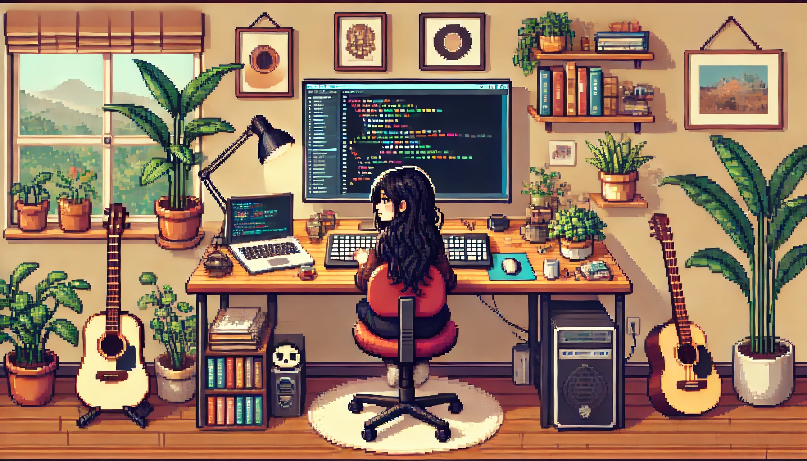

  

# ✨ Olá mundo, me chamo Maria Eduarda Xavier - Desenvolvedora de Software ✨

## Habilidades Tecnológicas

💻 Aqui estão algumas das tecnologias que eu domino:

## Vamos Criar Algo Incrível! 💫

💬 Quer colaborar em um projeto criativo e inovador? Estou sempre aberto a novas ideias e parcerias. Entre em contato comigo para discutirmos como podemos criar algo verdadeiramente extraordinário juntos. ✉️

## Vamos Conectar!

 
  
   

## Olá, mundo!

 

   <a href="https://github.com/mariadxavier">
   
   

 
  
  
  
  
  
  
  
          

 
  
 
  ### Pra entrar em contato comigo segue as redes abaixo!
 

 
  
   

