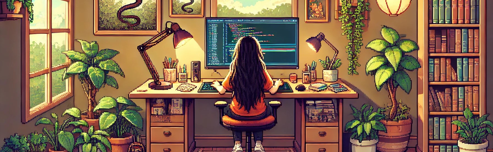

## Olá mundo! Me chamo Maria Eduarda Xavier e sou Desenvolvedora de Software

  

## Habilidades Tecnológicas

💻 Aqui estão algumas das tecnologias que eu domino:

 

## Vamos Criar Algo Incrível! 💫

💬 Quer colaborar em um projeto? Estou sempre aberta a novas ideias e parcerias. Entre em contato comigo pelos meios abaixo para discutirmos como podemos criar algo verdadeiramente extraordinário juntos:

 
  
   

  

<!-- 

  
  

 -->

 

