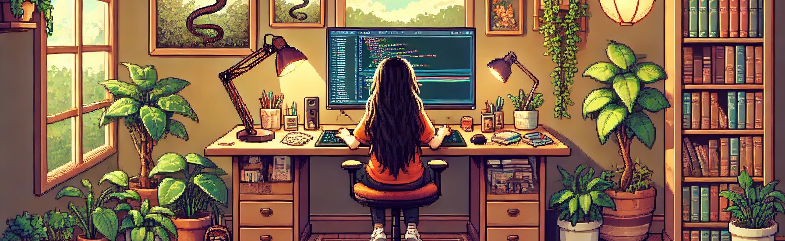

# ✨ Olá mundo, me chamo Maria Eduarda Xavier - Desenvolvedora de Software ✨

  

## Habilidades Tecnológicas

💻 Aqui estão algumas das tecnologias que eu domino:

 

## Vamos Criar Algo Incrível! 💫

💬 Quer colaborar em um projeto criativo e inovador? Estou sempre aberto a novas ideias e parcerias. Entre em contato comigo para discutirmos como podemos criar algo verdadeiramente extraordinário juntos. ✉️

## Vamos Conectar!

 
  
   

  

 

